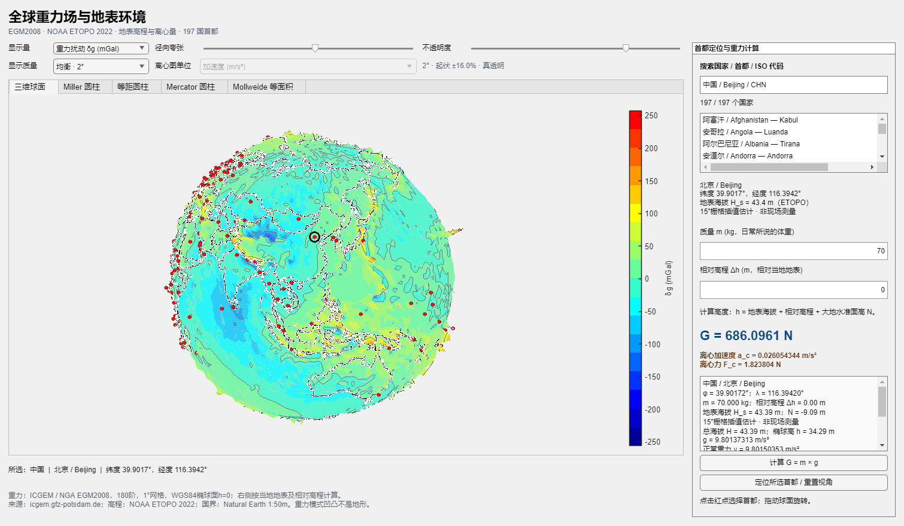
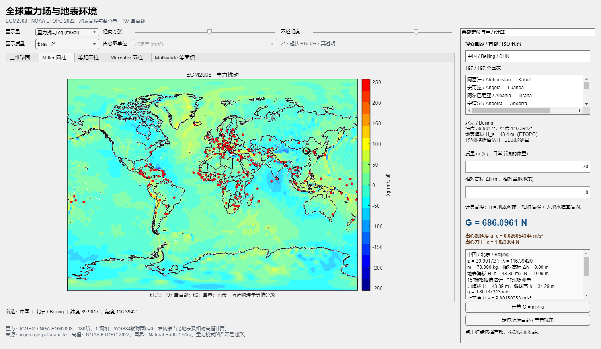
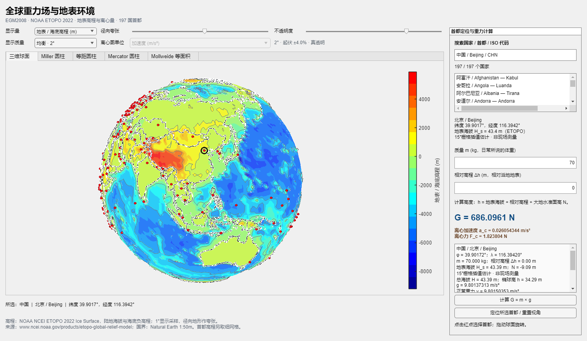
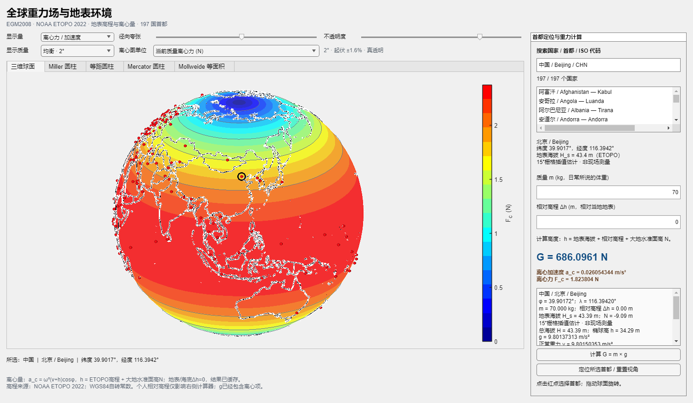
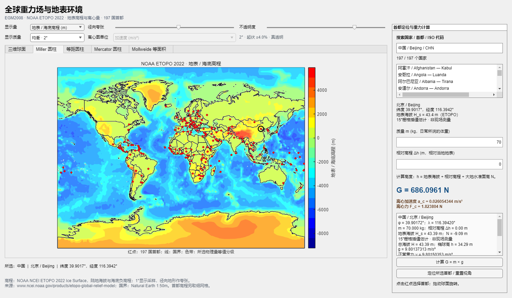

# 全球重力场 MATLAB 可视化

用 MATLAB 展示 EGM2008 全球重力场和 NOAA ETOPO 2022 地表环境：旋转三维起伏球面、切换四种二维投影、搜索 197 国首都，并计算给定质量和相对地表高程下的重力 `G=m×g` 与离心力。



## 快速启动

MATLAB R2022b 或更新版本，无需额外 MATLAB 工具箱。数据随仓库提供，日常运行无需联网。下载或克隆仓库后，在 MATLAB 中把当前文件夹设为仓库根目录，运行：

```matlab
cd('matlab_gravity_app')
gravity_field_app
```

默认采用均衡显示。若旋转卡顿，可用 `gravity_field_app('RenderQuality','fast')` 启动流畅档，或在界面上方切换“显示质量”；精细档可恢复完整 1° 显示网格。三档的 197 个首都和重力计算精度相同。详见 [渲染性能说明](matlab_gravity_app/PERFORMANCE.md)。

- 三维球面支持旋转和缩放，以 `jet` 分级色带、等值线和可调径向起伏显示重力；透明度可调，国界沿曲面绘制。
- 二维视图包括 Miller 圆柱、等距圆柱、Mercator 和 Mollweide 等面积投影。
- 197 个首都以红点标出，可在图中点击或按中英文国家名、首都名及 ISO 代码搜索。
- 显示量包括重力扰动 `δg`、总重力 `g`、地表/海底高程和离心量；右侧计算器显示质量、首都经纬度、地表海拔、相对高程、椭球高、当地 `g`、`G` 和离心力。
- 离心量可显示为加速度 `a_c`（m/s²）或按当前质量换算的力 `F_c`（N）。全球离心图固定取当地地表/海底 `Δh=0`；修改质量只改变 `force` 单位地图，修改相对高程只影响右侧计算器。
- 默认名单为 193 个联合国成员国，加梵蒂冈、巴勒斯坦、库克群岛、纽埃；启动无需再次确认。



## 模型和适用范围

重力数据来自 ICGEM 提供的官方 EGM2008 系数，是卫星、地面、航空及卫星测高资料融合模型；并非每个网格点的直接重力仪观测。本项目保留至 180 阶次，使用 1° 网格。可切换总重力 `g` 与相对 WGS84 正常重力的扰动 `δg`；计算器直接使用同一球谐模型。

球面的凹凸是所选场的显示夸张：高程模式按源地形 / 海底高程显示起伏，重力与离心模式按对应物理量映射。重力网格在 WGS84 椭球面零高度上求值；地表环境来自 NOAA NCEI ETOPO 2022 Ice Surface。ETOPO 的陆地高程和海域海底高程都保留，海洋不会统一改成零海拔。

计算器把输入的相对地表高程记为 `Δh`。地表正高为 `H_s` 时，总正高和椭球高分别为 `H=H_s+Δh`、`h=H_s+N+Δh`，其中 `N` 是 EGM2008 大地水准面起伏。有效重力 `g` 已包含地球自转离心项，`G=m×g` 不再重复加减离心力。地表和首都环境缓存带有源文件 SHA-256、算法版本、WGS84 常数和载荷校验；质量、相对高程和显示切换不会重建该缓存。

ETOPO 首都数据中有 5 个海岸混合样本，已按确认口径使用附近最近有效陆地栅格参与首都计算，同时保留原始 `H`，并显示采样距离和估计说明。详细字段和诊断记录见 [地表数据溯源](matlab_gravity_app/data/terrain_sources.md)。








详细操作、函数接口和重建方式见 [应用说明](matlab_gravity_app/README.md)。数据、公式及许可见 [来源说明](matlab_gravity_app/SOURCES.md) 和 [地理数据溯源](matlab_gravity_app/data/DATA_PROVENANCE.md)，已有 MATLAB 验证结果见 [验证记录](matlab_gravity_app/VALIDATION.md)。
