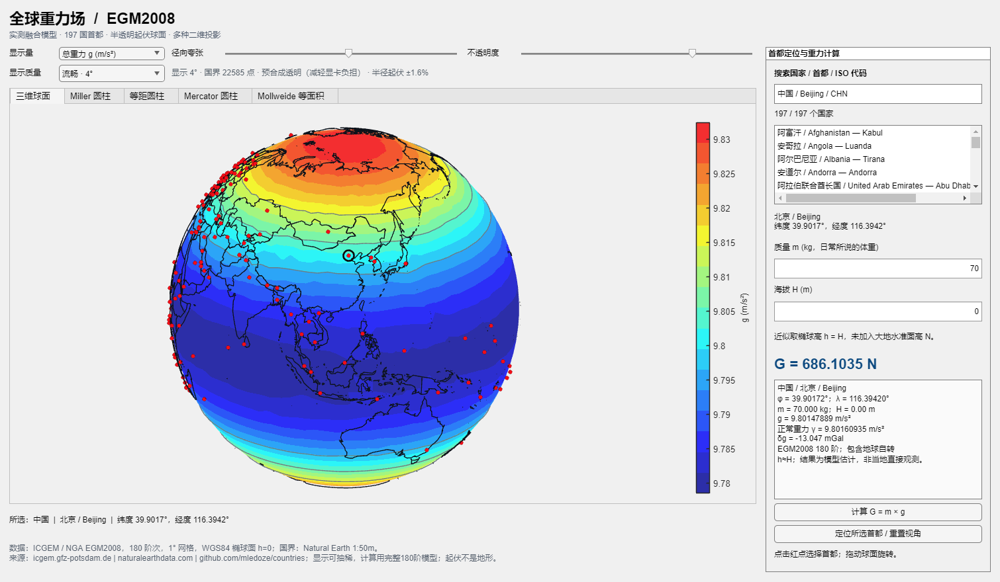

# 全球重力场与地表环境 MATLAB 项目

交互式全球重力、地表环境可视化与人体受力计算器，使用 **ICGEM 官方 EGM2008 实测融合模型**、NOAA NCEI ETOPO 2022、Natural Earth 国界与首都数据。已移除旧版人为正弦扰动和十国示例表；数据缺失时明确报错，不会换成模拟数据。

## 启动

MATLAB R2022b 或更新版本，**不需要额外 MATLAB 工具箱**。

```matlab
cd('matlab_gravity_app') % 从仓库根目录进入应用目录
gravity_field_app
```

如果已有旧版窗口正在运行，先关闭该窗口，再运行更新后的函数。默认使用均衡显示；卡顿明显时可直接启动流畅档：

```matlab
gravity_field_app('RenderQuality','fast')
```

界面上方的“显示质量”也可随时切换：

| 档位 | 显示采样间距 | 透明方式 | 用途 |
|---|---|---|---|
| 流畅 `fast` | 约 4° | 将透明颜色预合成到基底，单层不透明曲面 | 优先旋转响应，减少显卡排序负担 |
| 均衡 `balanced`（默认） | 约 2° | 真实半透明曲面及底层 | 日常交互 |
| 精细 `fine` | 原始 1° | 真实半透明曲面及底层 | 观察完整网格细节、截图 |

三档都保留 197 个首都和完整 180 阶重力计算。显示抽稀只影响画面细节；Mercator 的 ±85° 边界会额外保留。低档国界通过线条简化减轻绘制负担，但保留所有独立片段、小岛和闭合端点。精细档保留原始网格与国界点。性能说明与复现方法见 [PERFORMANCE.md](PERFORMANCE.md)。

默认使用已经确认的 **197 国名单**：193 个联合国成员国，加梵蒂冈、巴勒斯坦、库克群岛、纽埃。启动直接进入界面，无需再次确认。库中保留 199 条记录以支持自定义名单；名单不代表主权地位判定。也可显式指定默认口径：

```matlab
f = gravity_field_app('CountrySet','un197');
```

`'proposed197'` 保留为兼容旧脚本的别名。也可传入 197 个互不重复的 ISO3 代码组成的 cellstr。代码必须同时出现在 `data/countries_superset.csv` 和地表环境数据中；若自定义名单包含当前高程数据未覆盖的国家，需要先按对应首都坐标重建高程数据，否则程序明确报错。多首都和行政中心的选择在计算器中显示备注。

## 功能

- **大球面**独占左侧画布，拖动旋转、滚轮缩放。
- **真实国界**采用 Natural Earth 1:50m 边界，随显示档位简化并贴合起伏曲面。均衡与精细档使用黑白双线及半透明底层；流畅档减少描边并预合成透明颜色。
- **197 个红色首都点**可点击选择；支持中文/英文国家名、中文/英文首都名及 ISO 代码搜索。
- **等值绘图**使用 MATLAB 经典 `jet` 18 级色带与等值线；不透明度和径向夸张可调，夸张为 0 时恢复球面。
- **显示量可切换**：重力扰动 `δg`（mGal）突出地区差异，总重力 `g`（m/s²）显示绝对值；同一模式中半径与颜色使用同一种量。总重力模式的半径偏移最大为 ±3%，避免整体拉长成胶囊；界面显示实际起伏幅度。
- **地表环境显示**：地表 / 海底高程来自 NOAA ETOPO 2022；海域保留源数据中的负海底高程，不统一改成海平面。五个经确认的海岸混合首都使用附近最近有效陆地栅格参与计算，原始 `H`、采样距离和估计说明仍在数据溯源与界面中保留。
- **离心量显示**：可显示全球离心加速度 `a_c`（m/s²），或按当前质量换算的离心力 `F_c`（N）。全球图固定使用地表 / 海底 `Δh=0`；修改质量只改变 `force` 单位地图，修改相对高程只影响右侧计算器。
- **二维展开**：Miller、等距圆柱、Mercator、Mollweide 等面积投影，均有国界和可点选的首都；Mercator 限制纬度在 ±85°。
- **计算器**：输入质量 `m`（kg）与相对地表高程 `Δh`（m）。首都地表正高记为 `H_s`，计算 `H=H_s+Δh`、`h=H_s+N+Δh`，再由同一 EGM2008 球谐模型求 `g`，计算 `G=m*g`（N）和 `F_c=m*a_c`（N），并列出全部参数。显示夸张不影响受力计算。

总重力模式示例（流畅档，实际半径起伏 ±1.6%）：




## 数据与物理含义

EGM2008 由卫星、地面、航空及卫星测高资料约束，**不是每个网格点的直接重力仪读数**。本项目从官方系数保留至 **180 阶次**，生成 **1°×1°** 网格，最短半波长约 111 km。下载地址、SHA-256、公式与限制见 [SOURCES.md](SOURCES.md) 和 [gravity_model.md](data/gravity_model.md)。

- `g` 为引力与地球自转离心加速度合成后的模。
- `δg=g−γ`；`γ` 是同一位置的 WGS84 正常重力；`1 mGal=10^-5 m/s²`。
- 重力网格在 WGS84 **椭球面 h=0** 上求值，不是地形表面或平均海平面；右侧计算器使用 ETOPO 地表高程和大地水准面起伏求实际 `h`。
- ETOPO `H_s` 为相对 EGM2008 大地水准面的高程，`N` 为配套大地水准面起伏。输入为相对地表高程 `Δh` 时，`H=H_s+Δh`、`h=H+N=H_s+N+Δh`。全球离心图始终取 `Δh=0`。
- 离心加速度为 `a_c=ω²(ν+h)cosφ`，`ν=a/sqrt(1−e²sin²φ)` 是 WGS84 卯酉圈曲率半径；`F_c=m·a_c`。它指向远离自转轴的方向，一般不沿当地竖直方向。`g` 已包含地球自转离心项，`G=m×g` 不再重复加减 `F_c`。
- 地表环境缓存只保存与质量、相对高程无关的地表值和高度斜率；源文件 SHA-256、schema / algorithm version、WGS84 常数、数组形状及 payload SHA-256 一并校验，失效缓存会重新计算。
- 径向映射为 `r=1+Aeff*(q−q0)/max(abs(q−q0))`；`q` 为所选物理量，滑块值 `A` 在 0–0.3 之间。扰动模式 `q0=0`、`Aeff=A`；高程模式 `q0=0`、`Aeff=0.25*A`；总重力与离心模式的 `q0` 为数值范围中点、`Aeff=0.1*A`，最大半径偏移为 ±3%。半径仍随所选真实数值单调增加，颜色、色标及计算器数值不作缩放。零质量离心力图保留全零值并恢复球面。高程起伏依据源地形，但径向尺寸经过夸张；其他模式的起伏不代表真实地形或地球变形。
- 180 阶模型不刻画局地地形、建筑或矿体等细节，结果不等于现场测量精度。

首都高程独立采样 NOAA 的 15 角秒源网格，不从显示用的 1° 场插值。经确认的 5 个海岸混合样本，在各自原始 6×6 栅格窗口内选取距离不超过 1.5 km、`H>0` 的最近有效源格点；找不到候选时会报错。其余首都不套用此修正，也不会把所有负值改成零。

| ISO3 / 首都 | 原始双线性 H (m) | 采用的邻近 H_s (m) | 采样距离 (m) |
|---|---:|---:|---:|
| BHS / Nassau | -5.475 | 8.000 | 310.94 |
| COK / Avarua | -126.545 | 1.516 | 651.31 |
| MDV / Malé | -12.313 | 5.763 | 194.48 |
| MHL / Majuro | -8.574 | 2.015 | 337.72 |
| NRU / Yaren | -156.052 | 4.340 | 281.88 |

这 5 条记录继续使用原首都经纬度和原位置的大地水准面起伏 `N`；只有 `H_s` 使用邻近陆地估计。采样点的 `N` 另行保存供溯源，不替换原位置的 `N`。原始高程、采样坐标、距离与估计标记均保留，不能把该估计视为首都坐标处的实测高程。

## 函数与验证

```matlab
mass = 70;
[env, cacheInfo] = load_surface_environment;
k = find(strcmp(env.capitalIso3,'CHN'),1);
relativeHeight = 100; % 首都地表以上 100 m
h = env.capitalHSurface(k) + relativeHeight;
[g, detail] = gravity_at_location(env.capitalLatitude(k),env.capitalLongitude(k),h);
G = mass*g;
[ac, rotation] = centrifugal_at_location(env.capitalLatitude(k),h,mass);
Fc = rotation.force;
[x,y] = gravity_project([0,90],[0,45],'miller');
results = runtests('tests');
assert(all([results.Passed]));
```

计算核心直接求球谐势梯度，加入自转项。测试覆盖独立 SciPy 势函数差分参考值、两极、经度周期性、高度效应、投影公式、197 个标记、搜索、点击、质量成比例、透明度、径向映射和全部五种视图。名单按上述已确认口径使用。

渲染缓存会复用图形对象、等值线和投影数据。调透明度只更新样式；调径向夸张只更新坐标；返回已访问视图时不再清空重画，旋转角度与缩放位置会保留。

旋转使用与初始视图一致的相机尺度，避免第一次拖动后球体突然变小。缩放后切换显示质量、显示量或起伏也会保留缩放程度；“定位所选首都 / 重置视角”恢复完整球面。若直接拖动未启动旋转，可点击绘图区工具栏的“三维旋转”按钮后拖动。

数据已经随项目提供，日常运行不需要联网或 Python。首次启动会在本地生成离心环境缓存，后续通过校验后复用；不会因此联网下载资料。可选重建需要 Python、NumPy、SciPy，重建 ETOPO 还需 `requests`：

```text
python scripts/rebuild_gravity_data.py
python tools/build_geodata.py
python scripts/rebuild_terrain_data.py
```

第二步后在 MATLAB 执行 `addpath('tools'); finalize_geodata`，原生保存 Unicode 首都结构。原始快照与许可证见 `data/`；72 MB 官方压缩包缓存在 `.cache/`，不上传 Git。

| 文件 | 用途 |
|---|---|
| `gravity_field_app.m` | 球体、二维视图和计算器 |
| `gravity_at_location.m` | EGM2008 球谐计算 |
| `centrifugal_at_location.m` | WGS84 离心加速度和力；输入椭球高 |
| `gravity_project.m` | 无工具箱的投影公式 |
| `gravity_display_geometry.m` | 仅用于显示的网格抽稀与国界简化 |
| `data/gravity_grid.mat` | 181×361 重力/扰动网格 |
| `data/gravity_egm2008_n180_coefficients.mat` | 真实模型系数 |
| `data/world_geodata.mat` | 国界和首都候选目录 |
| `data/terrain_data.mat` | ETOPO 地表 / 海底高程、EGM2008 大地水准面起伏及 197 个首都环境值 |
| `load_surface_environment.m` | 读取、校验和缓存地表环境与离心量 |
| `tests/` | 物理及交互测试 |

Natural Earth 数据为公有领域；国家元数据及 OSM 补充坐标遵守随附 ODbL 许可，详见 `data/DATA_PROVENANCE.md`。ETOPO 产品、EGM2008 大地水准面、垂直基准、负海底高程策略、5 个海岸混合首都的最近有效陆地采样及诊断记录见 [地表来源说明](data/terrain_sources.md) 与 `data/terrain_provenance.json`。首都环境字段 `capitalElevationSampleDistanceM` 和 `capitalElevationIsEstimate` 用于在界面中说明采样距离与估计性质，原始双线性高程也保留在数据记录中。
