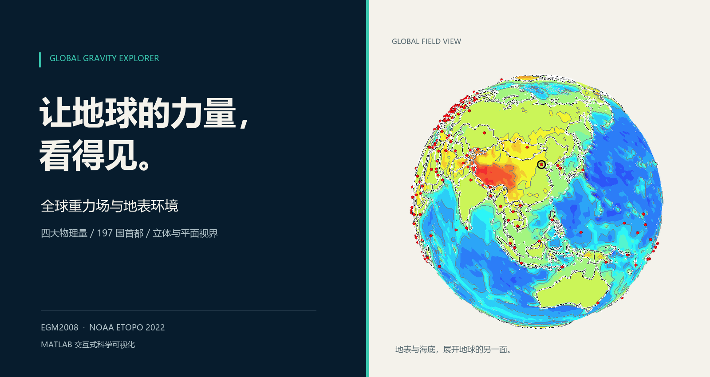
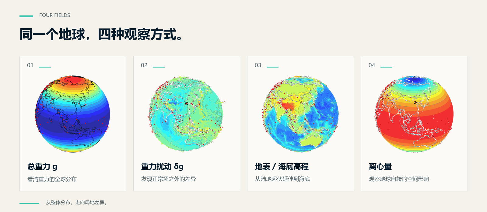
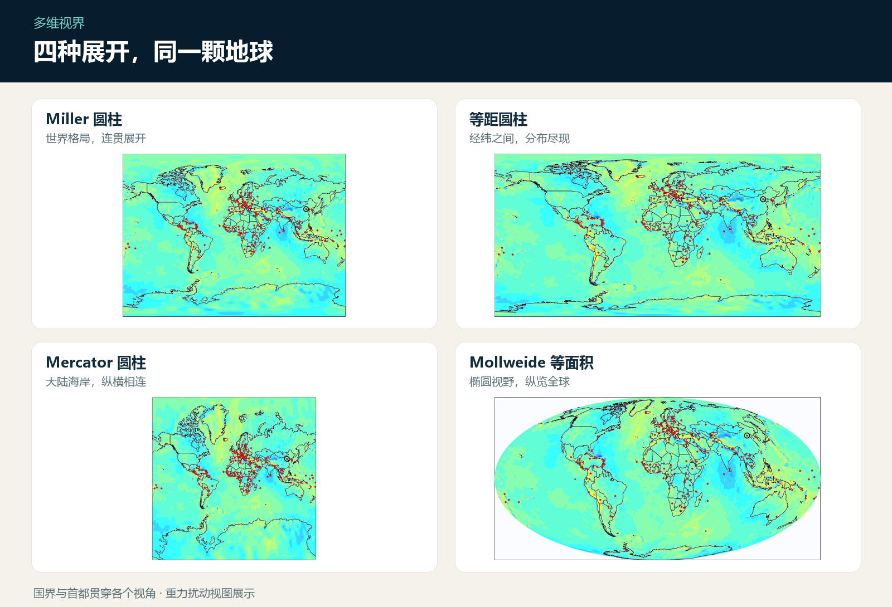
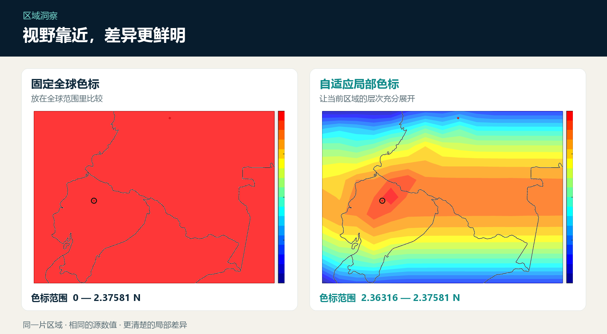

# 全球重力场与地表环境

### 让地球的力量，看得见。

从赤道到两极，从大陆山脉到深海，地球的物理面貌在色彩与起伏之间展开。

**全球分布、城市坐标与个人受力，在同一幅视界中相遇。** 既能纵览跨越大陆的宏观格局，也能聚焦一片区域，辨认那些原本不易察觉的细微差异。

| **4 大物理主题** | **5 种观察视角** | **197 国首都** |
| :---: | :---: | :---: |
| 重力 · 扰动 · 高程 · 离心量 | 立体球面 + 四种平面投影 | 红点定位 · 双语搜索 · 坐标关联 |

---

## 01｜一颗地球，四种面貌

### 总重力 · 看见力量的整体分布

全球重力强弱以连续的色彩层次呈现。跨越纬度与地域的数值关系，拥有直观的空间轮廓。

### 重力扰动 · 发现平缓背景中的变化

相对正常重力的区域差异被突出展现。细微变化汇聚为可辨认的色带与起伏，让地球呈现更丰富的层次。

### 地表与海底高程 · 从山巅延伸至深海

山地、高原与海底地形共同铺展。陆地海拔与海底负高程完整呈现，高低变化不止于海岸线。

### 离心量 · 感知自转中的地球

地球自转相关的空间差异一目了然。离心加速度与个人质量对应的离心力并列呈现，地表与海底高程的影响也在其中。

---

## 02｜立体视界，层次尽显

**一颗可自由旋转、缩放的起伏地球，让观察不止于正面。**

经典红、绿、蓝色带与等值线共同描绘物理量的分布；可调起伏赋予数值更鲜明的轮廓。半透明场景与清晰国界相互叠加，红色首都标记沿曲面呈现，让物理变化始终拥有地理参照。

从整体形态到区域细节，色彩、边界与空间层次同屏可见。

*球面起伏为视觉夸张；重力与离心量的凹凸不代表真实地形。*

## 03｜球面之外，世界有四种展开方式

**Miller 圆柱、等距圆柱、Mercator 圆柱、Mollweide 等面积**——四种平面视图，为同一颗地球提供不同的观察角度。

三维球面展现空间形态，二维地图展开分布关系。国家边界、首都位置与物理量色带贯穿各个视角，让全球比较与区域观察都有清晰的落点。

---

## 04｜视野靠近，细微差异拥有颜色

二维离心图支持**区域自适应色标**。视野聚焦之后，原先藏在全球色阶中的小幅变化获得更鲜明的层次，同纬度附近的高程影响也更容易被辨认。

**固定全球色标，提供统一的比较基准；自适应局部色标，突出当前区域的特点。** 单位与数值范围清楚标明，让每一种颜色都有明确含义。

视野与色彩在变化，所表达的数值保持一致。

---

## 05｜197 国首都，把世界连接到具体坐标

**一张全球地图，也是一份可检索的城市索引。**

- **红色首都标记**：197 国首都与行政中心在球面及平面地图上清晰呈现。
- **中英文名称搜索**：国家名、首都名与国家代码均可识别，熟悉与陌生的城市都有清楚的入口。
- **位置与信息联动**：城市名称、经纬度、地表高程与受力信息彼此对应。
- **醒目的选中标识**：关注的城市拥有明确位置，全球尺度的观察由此落到一座城市、一组坐标。

## 06｜个人受力，让地球与你有关

个人受力面板将质量、所在地与相对地表高度，与当地物理环境联系起来。

| **所处位置** | **高度层次** | **受力结果** |
| :--- | :--- | :--- |
| 国家、首都、经纬度 | 地表海拔、相对高程、总海拔、椭球高度 | 当地重力加速度、所受重力、离心加速度、离心力 |

质量变化带来的受力差别、高度变化带来的重力变化，都有直观的数值表达。位置、高度与结果并列可见，宏观的地球由此与个人尺度产生联系。

---

## 07｜三档品质，适合不同的观察节奏

**流畅 · 均衡 · 精细**

快速浏览、日常观察与细节展示，各有合适的画面表现。显示精细程度可以变化，197 国首都覆盖与物理计算结果保持一致，让不同视角下的观察拥有稳定的数值依据。

> **纵览全球的格局，辨认局部的变化。**
>
> **从一颗地球，到一个人的坐标。**

*图片为实际产品画面的宣传编排；球面起伏经视觉夸张，区域色彩增强不代表数据精度提高。*
